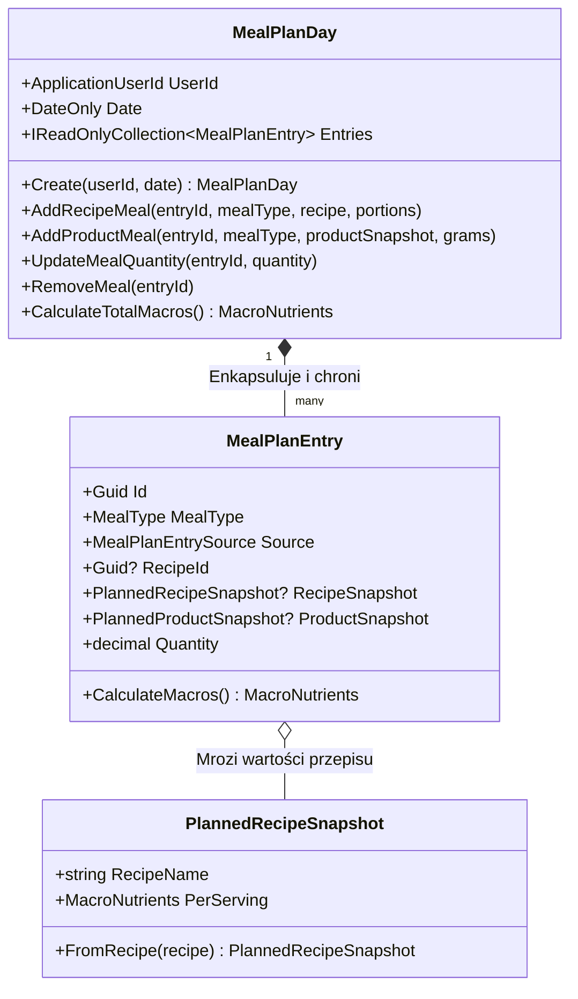
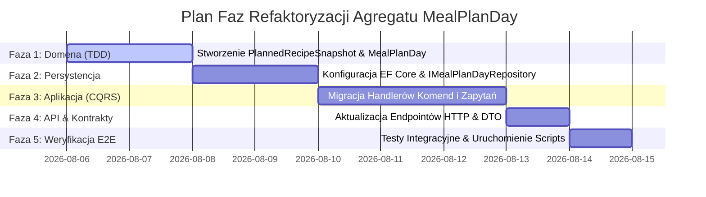

# Plan Refaktoryzacji Niezmiennika i Agregatu Domenowego — Jadlify

Dokument przedstawia analizę, identyfikację, diagnozę i projekt refaktoryzacji dla kluczowych niezmienników biznesowych w systemie **Jadlify**, ze szczególnym uwzględnieniem zaprojektowania agregatu-strażnika (**Aggregate Root**) zabezpieczającego spójność bilansu diety użytkownika.

---

## KROK 0 — Kontekst Produktu i Architektura (Context Discovery)

### 1. Wymagania i Wizja Produktu
System **Jadlify** jest aplikacją webową wspierającą planowanie posiłków, utrzymywanie celów makroskładnikowych oraz automatyczne generowanie list zakupów ([prd.md:20-25](file:///c:/Users/wikla/source/repos/Jadlify/context/foundation/prd.md#L20-L25)).
- **Rdzenna Hipoteza (Insight)**: Deklaratywne zaplanowanie posiłków z wyprzedzeniem sprawia, że cele makro trafiają się same, a lista zakupów wynika bezpośrednio z planu dnia ([prd.md:24](file:///c:/Users/wikla/source/repos/Jadlify/context/foundation/prd.md#L24)).
- **Sukces MVP**: Deterministyczna kalkulacja makro, brak duplikatów produktów na liście zakupów oraz 100% bezwarunkowa izolacja danych użytkowników ([prd.md:58-60](file:///c:/Users/wikla/source/repos/Jadlify/context/foundation/prd.md#L58-L60)).

### 2. Stos Technologiczny i Warstwy Systemu
Aplikacja została zbudowana w oparciu o Czystą Architekturę (Clean Architecture) w .NET 10 oraz React SPA ([tech-stack.md:15-30](file:///c:/Users/wikla/source/repos/Jadlify/context/foundation/tech-stack.md#L15-L30)):
- **Warstwa Prezentacji HTTP (API)**: `src/Jadlify.API` (ASP.NET Core Minimal APIs, routing HTTP, mapowanie DTO).
- **Warstwa Przypadków Użycia (Application)**: `src/Jadlify.Application` (Obsługa komend i zapytań CQRS przez wzorzec Mediator, walidacje `FluentValidation`, DTO, abstrakcje `IMealPlanRepository`, `IRecipeRepository`, `UserScope`).
- **Warstwa Domenowa (Domain)**: `src/Jadlify.Domain` (Encje, Value Objects, czysta logika kalkulacji makro bez zależności zewnętrznych).
- **Warstwa Persystencji (Infrastructure)**: `src/Jadlify.Infrastructure` (EF Core `JadlifyDbContext`, konfiguracje PostgreSQL `Npgsql`, repozytoria).
- **Warstwa Interfejsu Użytkownika (UI)**: `src/Jadlify.Web` (SPA React + Vite + TypeScript, stan formularzy, kalkulatory wizualne statusu makro).

---

## KROK 1 — Rejestr Niezmienników Biznesowych (Business Invariants Identification)

Poniżej zestawiono niezmienniki biznesowe zdefiniowane w dokumentacji i kodzie systemu, które w tej domenie **muszą być zawsze prawdziwe**.

### 1. Niezmiennik: Determinizm i spójność bilansu wartości odżywczych dnia (Meal Plan Day Macro & Ingredient Integrity)
- **Treść Reguły**: Bilans kaloryczny i makroskładnikowy danego dnia jest bezwzględną, deterministyczną sumą wszystkich zaplanowanych w tym dniu posiłków. Każdy zaplanowany posiłek musi odwoływać się do istniejącego zasobu lub zamrożonej migawki wartości odżywczych. Usunięcie lub edycja przepisu/produktu z katalogu nie może powodować cichego "wyparowania" kalorii z ułożonego planu dnia ani zepsuć bilansu odżywczego.
- **Cytaty Źródłowe**:
  - Dokument: [prd.md:59](file:///c:/Users/wikla/source/repos/Jadlify/context/foundation/prd.md#L59) *"wynik liczenia kcal/białka/tłuszczu/węglowodanów jest zawsze ten sam i odpowiada manualnemu przeliczeniu"*
  - Dokument: [prd.md:169-170](file:///c:/Users/wikla/source/repos/Jadlify/context/foundation/prd.md#L169-L170) *"składnik wnosi do sumy wartości proporcjonalne do gramatury, przepis wnosi wartości proporcjonalne do wybranej liczby porcji, dzień jest sumą wszystkich wpisów planu."*
  - Kod: [MacroCalculator.cs:65-74](file:///c:/Users/wikla/source/repos/Jadlify/src/Jadlify.Domain/Nutrition/MacroCalculator.cs#L65-L74) (`DayTotal`), [MealPlanDayProjection.cs:20-46](file:///c:/Users/wikla/source/repos/Jadlify/src/Jadlify.Application/Planning/MealPlanDayProjection.cs#L20-L46)

### 2. Niezmiennik: Unikalność aktywnej listy zakupów oraz nienaruszalność listy zakończonej (Shopping List Active Uniqueness & Completed Immutability)
- **Treść Reguły**: Użytkownik posiada w dowolnym momencie co najwyżej jedną aktywną listę zakupów (`ShoppingListStatus.Active`). Po przejściu w status `Completed`, lista zakupów staje się absolutnie niemodyfikowalna — zmiana pozycji, usuwanie ani odznaczanie zakupionych produktów jest zablokowane.
- **Cytaty Źródłowe**:
  - Dokument: [prd.md:146](file:///c:/Users/wikla/source/repos/Jadlify/context/foundation/prd.md#L146) (FR-015: Wygenerowanie listy z planu)
  - Kod: [ShoppingList.cs:175-178](file:///c:/Users/wikla/source/repos/Jadlify/src/Jadlify.Domain/Shopping/ShoppingList.cs#L175-L178) (`EnsureActive` rzuca `InvalidOperationException`), [CreateShoppingListCommandHandler.cs:45](file:///c:/Users/wikla/source/repos/Jadlify/src/Jadlify.Application/Shopping/ShoppingLists/CreateShoppingList/CreateShoppingListCommandHandler.cs#L45)

### 3. Niezmiennik: Integralność składników i skalowania porcji w przepisie (Recipe Ingredients & Portions Integrity)
- **Treść Reguły**: Przepis musi zawierać co najmniej jeden składnik (`Ingredients.Count >= 1`), wszystkie składniki w przepisie muszą odwoływać się do unikalnych produktów (brak zduplikowanego `ProductId`), a zadeklarowana liczba porcji musi być ściśle dodatnia (`Portions > 0`).
- **Cytaty Źródłowe**:
  - Dokument: [prd.md:122](file:///c:/Users/wikla/source/repos/Jadlify/context/foundation/prd.md#L122) (FR-007: Przepis składający się ze składników i liczby porcji)
  - Kod: [Recipe.cs:10](file:///c:/Users/wikla/source/repos/Jadlify/src/Jadlify.Domain/Recipes/Recipe.cs#L10), [Recipe.cs:40-44](file:///c:/Users/wikla/source/repos/Jadlify/src/Jadlify.Domain/Recipes/Recipe.cs#L40-L44) (walidacja duplikatów), [Recipe.cs:56-59](file:///c:/Users/wikla/source/repos/Jadlify/src/Jadlify.Domain/Recipes/Recipe.cs#L56-L59) (walidacja braku składników)

### 4. Niezmiennik: Ziarnistość porcjowania i wzajemna wyłączność źródła posiłku (Meal Plan Entry Source & Portion Step Invariant)
- **Treść Reguły**: Wpis w planie posiłków posiada dokładnie jedno źródło: referencję do przepisu (`MealPlanEntrySource.Recipe`) mierzoną w porcjach LUB zamrożoną migawkę produktu (`MealPlanEntrySource.Product`) mierzoną w gramach. Porcje dla przepisu muszą być dodatnią wielokrotnością 0.5 porcji (`portions > 0` oraz `portions % 0.5 == 0`), a gramatura dla produktu musi być ściśle dodatnia (`grams > 0`).
- **Cytaty Źródłowe**:
  - Dokument: [prd.md:137](file:///c:/Users/wikla/source/repos/Jadlify/context/foundation/prd.md#L137) (FR-012: Typ posiłku oraz liczba porcji)
  - Kod: [MealPlanEntry.cs:16](file:///c:/Users/wikla/source/repos/Jadlify/src/Jadlify.Domain/Planning/MealPlanEntry.cs#L16) (`PortionStep = 0.5m`), [MealPlanEntry.cs:68](file:///c:/Users/wikla/source/repos/Jadlify/src/Jadlify.Domain/Planning/MealPlanEntry.cs#L68) (`ForRecipe`), [MealPlanEntry.cs:85](file:///c:/Users/wikla/source/repos/Jadlify/src/Jadlify.Domain/Planning/MealPlanEntry.cs#L85) (`ForProduct`), [MealPlanEntry.cs:143-149](file:///c:/Users/wikla/source/repos/Jadlify/src/Jadlify.Domain/Planning/MealPlanEntry.cs#L143-L149) (`EnsureValidPortions`)

### 5. Niezmiennik: Bezwarunkowa izolacja danych użytkownika (Per-User Data Isolation Guardrail)
- **Treść Reguły**: Zasoby domenowe (produkty, przepisy, plany posiłków, cele, listy zakupów) są bezwzględnie odizolowane per identyfikator użytkownika (`ApplicationUserId`). Żadne zapytanie nie może zwrócić ani zmodyfikować encji należącej do innego użytkownika.
- **Cytaty Źródłowe**:
  - Dokument: [prd.md:58](file:///c:/Users/wikla/source/repos/Jadlify/context/foundation/prd.md#L58) (Guardrails: Izolacja danych per-user)
  - Kod: [UserScope.cs:9](file:///c:/Users/wikla/source/repos/Jadlify/src/Jadlify.Application/Identity/UserScope.cs#L9), [JadlifyDbContext.cs:30-45](file:///c:/Users/wikla/source/repos/Jadlify/src/Jadlify.Infrastructure/Persistence/JadlifyDbContext.cs#L30-L45) (EF Core Global Query Filters)

### 6. Niezmiennik: Nieujemność i poprawność odżywcza produktów (Product MacroNutrients Non-negativity)
- **Treść Reguły**: Bazowe wartości odżywcze na 100g produktu (kalorie, białko, tłuszcz, węglowodany) muszą być nieujemne (`>= 0`), a nazwa produktu musi być niepustym ciągiem znaków.
- **Cytaty Źródłowe**:
  - Dokument: [prd.md:112](file:///c:/Users/wikla/source/repos/Jadlify/context/foundation/prd.md#L112) (FR-003: Wartości odżywcze na 100g)
  - Kod: [MacroNutrients.cs:7-10](file:///c:/Users/wikla/source/repos/Jadlify/src/Jadlify.Domain/Nutrition/MacroNutrients.cs#L7-L10), [Product.cs:25](file:///c:/Users/wikla/source/repos/Jadlify/src/Jadlify.Domain/Products/Product.cs#L25)

---

## KROK 2 — Klasyfikacja Niezmienników i Wybór #1 (Classification & Selection)

W poniższej tabeli przeanalizowano zidentyfikowane niezmienniki na trzech osiach: (a) rdzenność dla sensu produktu, (b) stopień rozsmarowania po warstwach, (c) poziom egzekwowania / podatność na naruszenie.

| Niezmiennik | (a) Rdzenność dla Produktu | (b) Rozsmarowanie po Warstwach | (c) Poziom Egzekwowania | Klasyfikacja i Werdykt |
| :--- | :--- | :--- | :--- | :--- |
| **#1 Determinizm i spójność bilansu makro dnia (`MealPlanDay`)** | **KRYTYCZNIE RDZENIOWY** — Sercem produktu jest idealne trafianie w makro poprzez ułożony plan ([prd.md:24](file:///c:/Users/wikla/source/repos/Jadlify/context/foundation/prd.md#L24)). | **MOCNO ROZSMAROWANY** — Brak Agregatu `MealPlanDay`. Logika żyje w projekcjach zapytań (`MealPlanDayProjection.cs`), serwisach domenowych (`MacroCalculator.cs`) oraz UI (`plannerMacros.ts`). | **NARUSZALNY / POŁYKANY** — Usunięcie przepisu kasuje rekord w bazie, a projekcja odczytu cicho zwraca 0 kcal (`MacroNutrients.Zero`). Kalorie w planie znikają bez błędu. | **WYBRANY PRIORYTET #1** |
| **#2 Unikalność aktywnej listy zakupów i immutability listy zakończonej** | **RDZENIOWY** — Drugi kluczowy filar w PRD ([prd.md:24](file:///c:/Users/wikla/source/repos/Jadlify/context/foundation/prd.md#L24)). | **ŚREDNIO ROZSMAROWANY** — Agregat `ShoppingList` istnieje, ale reguła 1 aktywnej listy żyje w handlerze komendy (`CreateShoppingListCommandHandler.cs`). | **EGZEKWOWANY** — Immutability w agregacie (`EnsureActive`), unikalność aktywnej w aplikacji. | Kandydat #2 |
| **#3 Składniki i porcje w przepisie** | **WSPIERAJĄCY** — Budulec przepisów. | **ZWARTY** — Żyje wewnątrz encji `Recipe.cs`. | **MOCNO EGZEKWOWANY** — Rzuca wyjątki domenowe wewnątrz `Recipe.cs`. | Odrzucony |
| **#4 Ziarnistość porcjowania (krok 0.5)** | **SZCZEGÓŁ LOGIKI** — Walidacja wpisów. | **ZWARTY** — Wewnątrz `MealPlanEntry.cs`. | **MOCNO EGZEKWOWANY** — Sprawdzane w `EnsureValidPortions`. | Odrzucony |
| **#5 Izolacja danych per-user** | **GUARDRAIL / OGÓLNY** — Bezpieczeństwo. | **INFRASTRUKTURA** — EF Core Global Query Filters. | **MOCNO EGZEKWOWANY** — Automatyczny filtr na poziomie DbContext. | Odrzucony |

### Uzasadnienie Wyboru Niezmiennika #1:
Niezmiennik **"Determinizm i spójność transakcyjna bilansu planu posiłków danego dnia (`MealPlanDay` Macro Integrity)"** jest priorytetem #1. PRD zakłada, że użytkownik ułoży plan posiłków tak, aby w podsumowaniu dnia otrzymać w 100% deterministyczny wynik kalorii i makroskładników. Tymczasem w architekturze **w ogóle nie istnieje Agregat Domenowy reprezentujący Dzień Planu Posiłków (`MealPlanDay`)**. 

Dzień jest obecnie jedynie wirtualnym zbiorem płaskich encji `MealPlanEntry` zapisywanych bezpośrednio w tabeli `meal_plan_entries`. Gdy użytkownik usunie przepis z katalogu poprzez `DeleteRecipeCommandHandler`, komenda usuwa przepis z bazy danych. Gdy system próbuje wyliczyć makro dnia (`GetDailyMacroSummaryQueryHandler`), klasa `MealPlanDayProjection` **cicho "połyka" brakujący przepis**, ustawiając jego makroskładniki na 0 kcal. Użytkownik widzi, że jego bilans dnia nagle spadł o kilkaset kalorii, bez żadnej informacji o błędzie czy naruszeniu spójności planu.

---

## KROK 3 — Diagnoza Wybranego Niezmiennika (Diagnosis of Invariant #1)

Obecnie egzekwowanie spójności dnia posiłków jest poważnie naruszone i rozsmarowane w 5 warstwach:

```
[UI: plannerMacros.ts] (Sam przelicza statusy)
        ▲
        │ DTO z cicho zerowanymi wartościami
[API: MapMealPlanEndpoints.cs] (Brak reprezentacji agregatu dnia)
        ▲
        │ Zbiór luźnych MealPlanEntry
[Application: GetDailyMacroSummaryQueryHandler.cs] & [MealPlanDayProjection.cs] (Połykanie braków przepisów)
        ▲
        │ Zapytania bezpośrednie bez granicy transakcyjnej
[Infrastructure: MealPlanRepository.cs] (Operacje na płaskich rekordach DB)
        ▲
        │ Brak tabeli / Agregatu MealPlanDay
[Domain: MealPlanEntry.cs] (Encja bez wiedzy o kontekście i spójności całego dnia)
```

### Szczegółowa Diagnoza Kodowa:

1. **Brak Granicy Agregatu w Domenie (`src/Jadlify.Domain/Planning/`)**:
   - `MealPlanEntry.cs:10-43` ([MealPlanEntry.cs:10](file:///c:/Users/wikla/source/repos/Jadlify/src/Jadlify.Domain/Planning/MealPlanEntry.cs#L10)) — `MealPlanEntry` jest encją posiadającą pole `DateOnly Date`. Nie istnieje klasa `MealPlanDay`, która reprezentowałaby dzień jako spójną całość transakcyjną z własnymi regułami biznesowymi.

2. **Połykanie Błędów i Ciche Ucinanie Makroskładników w Projekcji zapytań**:
   - `MealPlanDayProjection.cs:32-38` ([MealPlanDayProjection.cs:32](file:///c:/Users/wikla/source/repos/Jadlify/src/Jadlify.Application/Planning/MealPlanDayProjection.cs#L32)):
     ```csharp
     if (!MealPlanRecipeResolution.TryResolve(entry, recipesById, out Recipe? recipe))
     {
         entryMacros.Add(new MealEntryMacroDto(
             entry.Id,
             RecipeMacroSummaryDto.FromDomain(MacroNutrients.Zero)));
         continue;
     }
     ```
     *Diagnoza*: Gdy przepis powiązany z wpisem planu zostanie usunięty z bazy, aplikacja nie rzuca błędu domenowego (brak *fail-fast*) ani nie komunikuje problemu w DTO. Zamiast tego cicho przypisuje wpisowi `MacroNutrients.Zero`, co natychmiast zniekształca bilans kaloryczny ułożonej diety.

3. **Rozsmarowanie Logiki Pobierania i Łączenia Przepisów w Warstwie Aplikacji**:
   - `GetDailyMacroSummaryQueryHandler.cs:30-40` ([GetDailyMacroSummaryQueryHandler.cs:30](file:///c:/Users/wikla/source/repos/Jadlify/src/Jadlify.Application/Planning/DailyMacroSummary/GetDailyMacroSummaryQueryHandler.cs#L30)): Handler zapytania odczytuje wpisy z `IMealPlanRepository`, dociąga przepisy z `IRecipeRepository` i ręcznie wywołuje `MealPlanDayProjection.Build`. Logika składania dnia w całą strukturę wyciekła z domeny do handlera CQRS.

4. **Brak Bezpieczeństwa Transakcyjnego w Persystencji**:
   - `IMealPlanRepository.cs:13-63` ([IMealPlanRepository.cs:13](file:///c:/Users/wikla/source/repos/Jadlify/src/Jadlify.Application/Planning/IMealPlanRepository.cs#L13)): Metody `AddAsync`, `UpdateAsync`, `DeleteAsync` zapisują i kasują pojedyncze wpisy w bazie. Nie ma możliwości załadowania całego Dnia Planu jako niepodzielnego agregatu w pojedynczym Unit of Work.

5. **Brak Blokady / Ochrony przy Usuwaniu Przepisu**:
   - `DeleteRecipeCommandHandler.cs:15-16` ([DeleteRecipeCommandHandler.cs:15](file:///c:/Users/wikla/source/repos/Jadlify/src/Jadlify.Application/Recipes/DeleteRecipe/DeleteRecipeCommandHandler.cs#L15)): Komenda usuwania przepisu bezrefleksyjnie wywołuje `_recipes.DeleteAsync(command.Id)`. Nie istnieje żaden domenowy ani aplikacyjny strażnik, który weryfikowałby, czy przepis nie jest w tej chwili częścią czyjegoś ułożonego planu posiłków.

6. **UI jako Jedyny Klient Interpreting Status**:
   - `plannerMacros.ts:46-58` ([plannerMacros.ts:46](file:///c:/Users/wikla/source/repos/Jadlify/src/Jadlify.Web/src/planning/plannerMacros.ts#L46)): Frontend w React podejmuje decyzję wizualną o statusie dnia (`cel osiągnięty`, `przekroczono`, `zostało`), operując na liczbach, które serwer wyliczył po cichym wyzerowaniu brakujących przepisów.

---

## KROK 4 — Projekt Agregatu-Strażnika (`MealPlanDay`) (Aggregate Guard Design)

Projekt wprowadza **Agregat Domenowy `MealPlanDay`** jako **JEDYNE** miejsce egzekwowania niezmiennika spójności i determinizmu planu posiłków w danym dniu.

### 1. Architektura Agregatu `MealPlanDay` i Strategia Migawki (`PlannedRecipeSnapshot`)
Aby uniknąć problemu cicho usuniętych przepisów oraz zapewnić pełną historyczną immutability ułożonego planu diety (analogicznie do istniejącej migawki dla produktów `PlannedProductSnapshot`), wpis posiłku oparty na przepisie będzie mroził wartości odżywcze per-porcję w obiekcie wartości **`PlannedRecipeSnapshot`**.

Dzięki temu:
1. Usunięcie lub edycja przepisu w katalogu **NIE zniszczy** i **NIE zmieni** wartości odżywczych już ułożonego planu posiłków!
2. Kalkulacja makro dla całego dnia staje się w 100% deterministyczna i niezależna od zewnętrznych zapytań do repozytorium przepisów.



### 2. Nazwane Wyjątki Domenowe (Fail-Fast Domain Exceptions)

Wszystkie nielegalne operacje rzucają nazwane wyjątki domenowe (brak cichego kontynuowania):
- `InvalidMealPortionsException`: Rzucany przy próbie podania porcji <= 0 lub niebędącej wielokrotnością 0.5.
- `InvalidProductGramsException`: Rzucany przy podaniu masy w gramach <= 0.
- `MealPlanEntryNotFoundException`: Rzucany przy próbie modyfikacji lub usunięcia nieistniejącego wpisu posiłku w danym dniu.
- `EmptyMealPlanDayException`: Rzucany przy operacjach wymagających obecności posiłków.

### 3. Pseudokod Agregatu `MealPlanDay` (C# 13 / .NET 10)

```csharp
namespace Jadlify.Domain.Planning;

public sealed class MealPlanDay
{
    private readonly List<MealPlanEntry> _entries = new();

    public ApplicationUserId UserId { get; }
    public DateOnly Date { get; }
    public IReadOnlyCollection<MealPlanEntry> Entries => _entries.AsReadOnly();

    private MealPlanDay(ApplicationUserId userId, DateOnly date)
    {
        UserId = userId;
        Date = date;
    }

    public static MealPlanDay Create(ApplicationUserId userId, DateOnly date)
    {
        return new MealPlanDay(userId, date);
    }

    public void AddRecipeMeal(
        Guid entryId,
        MealType mealType,
        Recipe recipe,
        decimal portions)
    {
        ArgumentNullException.ThrowIfNull(recipe);
        EnsureValidPortions(portions);

        var recipeSnapshot = PlannedRecipeSnapshot.FromRecipe(recipe);
        var entry = MealPlanEntry.ForRecipeSnapshot(
            entryId,
            Date,
            mealType,
            recipe.Id,
            recipeSnapshot,
            portions);

        _entries.Add(entry);
    }

    public void AddProductMeal(
        Guid entryId,
        MealType mealType,
        PlannedProductSnapshot productSnapshot,
        decimal grams)
    {
        ArgumentNullException.ThrowIfNull(productSnapshot);
        if (grams <= 0m)
        {
            throw new InvalidProductGramsException(grams);
        }

        var entry = MealPlanEntry.ForProduct(
            entryId,
            Date,
            productSnapshot,
            mealType,
            grams);

        _entries.Add(entry);
    }

    public void UpdateMealQuantity(Guid entryId, decimal quantity)
    {
        var entry = _entries.FirstOrDefault(e => e.Id == entryId);
        if (entry is null)
        {
            throw new MealPlanEntryNotFoundException(entryId);
        }

        if (entry.Source is MealPlanEntrySource.Recipe)
        {
            EnsureValidPortions(quantity);
        }
        else if (quantity <= 0m)
        {
            throw new InvalidProductGramsException(quantity);
        }

        entry.UpdateQuantity(quantity);
    }

    public void RemoveMeal(Guid entryId)
    {
        var entry = _entries.FirstOrDefault(e => e.Id == entryId);
        if (entry is null)
        {
            throw new MealPlanEntryNotFoundException(entryId);
        }

        _entries.Remove(entry);
    }

    public MacroNutrients CalculateTotalMacros()
    {
        MacroNutrients total = MacroNutrients.Zero;
        foreach (var entry in _entries)
        {
            total += entry.CalculateMacros(); // Fail-fast, deterministyczne, brak połykania błędów!
        }
        return total;
    }

    private static void EnsureValidPortions(decimal portions)
    {
        if (portions <= 0m || portions % MealPlanEntry.PortionStep != 0m)
        {
            throw new InvalidMealPortionsException(portions);
        }
    }
}
```

### 4. Interfejs Repozytorium Agregatu (`IMealPlanDayRepository`)

Repozytorium ładuje i zapisuje **cały Agregat `MealPlanDay`** w pojedynczym Unit of Work (jedna transakcja bazodanowa), zapewniając niepodzielność zmian w planie dnia.

```csharp
namespace Jadlify.Application.Planning;

public interface IMealPlanDayRepository
{
    Task<MealPlanDay?> GetByDateAsync(DateOnly date, CancellationToken cancellationToken = default);

    Task SaveAsync(MealPlanDay mealPlanDay, CancellationToken cancellationToken = default);

    Task DeleteDayAsync(DateOnly date, CancellationToken cancellationToken = default);
}
```

### 5. Cienki Handler API / Route (Presentation Layer)

Egzekucja przenosi się w 100% na serwer. Route HTTP parsuje wejście, wywołuje metodę na agregacie i mapuje wyjątki domenowe na czytelne statusy HTTP:

```csharp
public static async Task<IResult> AddMealEntryEndpoint(
    AddMealEntryRequest request,
    IMediator mediator,
    CancellationToken ct)
{
    var command = new AddMealPlanEntryCommand(
        request.Date,
        request.MealType,
        request.RecipeId,
        request.ProductId,
        request.Portions,
        request.Grams);

    var result = await mediator.SendAsync(command, ct);

    return result.Match(
        onSuccess: () => Results.Created(),
        onFailure: error => error.Code switch
        {
            "MealPlan.InvalidPortions" => Results.BadRequest(new { error = error.Message }),
            "MealPlan.NotFound" => Results.NotFound(new { error = error.Message }),
            _ => Results.Problem(error.Message)
        });
}
```

---

## KROK 5 — Before / After, Plan Faz, Testy i Rejestr Nazw (Refactor Plan & Verification)

### 1. Porównanie Before vs After dla Warstw Systemu

| Warstwa Systemu | Stan Obecny (Before) | Stan Docelowy (After - Agregat `MealPlanDay`) |
| :--- | :--- | :--- |
| **Domain** | Płaska encja `MealPlanEntry` z wyliczaniem makro poza domena w `MealPlanDayProjection`. Brak reprezentacji dnia. | Korzeń agregatu `MealPlanDay` enkapsulujący posiłki dnia. Zamrożona migawka `PlannedRecipeSnapshot`. Wyjątki `InvalidMealPortionsException`. |
| **Application** | Handlery CQRS ręcznie łączą `IMealPlanRepository` i `IRecipeRepository`. Projekcja cicho wyzerowuje usunięte przepisy (`MacroNutrients.Zero`). | Handler ładuje `MealPlanDay` z `IMealPlanDayRepository`, wywołuje metodę domenową i zapisuje agregat w 1 transakcji. Zero połykania błędów. |
| **Infrastructure** | EF Core zapisuje i usuwa luźne rekordy z tabeli `meal_plan_entries`. Brak konfiguracji agregatu. | EF Core mapuje `MealPlanDay` wraz z powiązaną kolekcją wpisów i migawkowanymi wartościami odżywczymi. |
| **API** | Endpointy delegują do płaskich komend dodawania wpisów. | Endpointy przyjmują żądania, oddelegowują do agregatu i mapują nazwane wyjątki domenowe na odpowiednie kody HTTP (400/404). |
| **UI (React)** | Frontend sam przelicza statusy diety i operuje na DTO z cicho obciętymi kaloriami. | Frontend wyświetla spójny, serwerowo przeliczony bilans dnia. Otrzymuje gwarancję nienaruszalności ułożonego planu. |

### 2. Plan Faz Refaktoryzacji

Refaktoryzacja zostanie przeprowadzona zgodnie z dyscypliną **Test-First (TDD)**:



- **Faza 1: Domena (Test-First)**
  - Napisanie testów jednostkowych w `tests/Jadlify.Domain.Tests/Planning/MealPlanDayTests.cs` dla tworzenia dnia, dodawania posiłków w porcjach/gramach, przeliczania makro oraz rzucania wyjątków domenowych.
  - Implementacja `PlannedRecipeSnapshot` oraz agregatu `MealPlanDay`.
- **Faza 2: Infrastruktura i Persystencja**
  - Stworzenie `MealPlanDayConfiguration` dla EF Core.
  - Implementacja `MealPlanDayRepository` w `Jadlify.Infrastructure`.
  - Napisanie testów integracyjnych w `tests/Jadlify.Infrastructure.Tests`.
- **Faza 3: Warstwa Aplikacji (CQRS)**
  - Zaktualizowanie handlerów `AddMealPlanEntryCommandHandler`, `UpdateMealPlanEntryCommandHandler`, `GetDailyMacroSummaryQueryHandler` na korzystanie z agregatu `MealPlanDay`.
  - Usunięcie cichego połykania błędów z `MealPlanDayProjection`.
- **Faza 4: API i Mapowanie Błędów**
  - Aktualizacja endpointów HTTP w `Jadlify.API` i mapowania błędów na odpowiedzi HTTP 400 Bad Request / 404 Not Found.
- **Faza 5: Weryfikacja i Testy Regresji**
  - Uruchomienie pełnego pakietu weryfikacyjnego: `pwsh ./.scripts/verify-min.ps1`.

### 3. Zestaw Przypadków Testowych TDD (Test Cases)

#### Legalne Operacje (Positive Test Cases):
1. `AddRecipeMeal_WithValidPortions_CalculatesTotalMacrosCorrectly`: Dodanie przepisu o porcji `1.5` przelicza makro dnia jako `1.5 * PerServing` i dodaje do sumy dnia.
2. `AddProductMeal_WithValidGrams_CalculatesTotalMacrosCorrectly`: Dodanie produktu o masie `200g` przelicza makro jako `2.0 * Per100Grams`.
3. `RemoveMeal_ExistingEntry_UpdatesDayTotalMacros`: Usunięcie posiłku z dnia przelicza sumę makroskładników bez usuniętego wpisu.
4. `CatalogRecipeDeleted_MealPlanDayKeepSnapshot`: Usunięcie przepisu z katalogu produktów **NIE wpływa** na makro wcześniej zaplanowanego dnia (odporność migawki `PlannedRecipeSnapshot`).

#### Nielegalne Operacje / Fail-Fast (Negative Test Cases):
1. `AddRecipeMeal_WithInvalidPortionStep_ThrowsInvalidMealPortionsException`: Próba dodania porcji `0.3` lub `0.7` rzuca `InvalidMealPortionsException`.
2. `AddRecipeMeal_WithZeroOrNegativePortions_ThrowsInvalidMealPortionsException`: Próba dodania `0` lub `-1` porcji rzuca `InvalidMealPortionsException`.
3. `AddProductMeal_WithZeroOrNegativeGrams_ThrowsInvalidProductGramsException`: Próba dodania `0g` lub `-50g` produktu rzuca `InvalidProductGramsException`.
4. `UpdateMealQuantity_NonExistentEntry_ThrowsMealPlanEntryNotFoundException`: Próba aktualizacji nieistniejącego wpisu w dniu rzuca `MealPlanEntryNotFoundException`.
5. `RemoveMeal_NonExistentEntry_ThrowsMealPlanEntryNotFoundException`: Próba usunięcia nieistniejącego wpisu z dnia rzuca `MealPlanEntryNotFoundException`.

### 4. Rejestr Nowych Nazw Load-Bearing (Contract Surfaces Register)

Zgodnie ze standardami projektu, nowe nazwy domenowe i kontrakty należy zarejestrować w `docs/reference/contract-surfaces.md`:

- **`MealPlanDay`** — Korzeń Agregatu (Aggregate Root) reprezentujący dzień planu posiłków.
- **`PlannedRecipeSnapshot`** — Obiekt Wartości (Value Object) zamrażający wartości odżywcze przepisu w momencie dodania do planu.
- **`IMealPlanDayRepository`** — Interfejs Repozytorium dla całego Agregatu Dnia.
- **`InvalidMealPortionsException`** — Nazwany Wyjątek Domenowy rzucany przy nieprawidłowych porcjach przepisu.
- **`InvalidProductGramsException`** — Nazwany Wyjątek Domenowy rzucany przy nieprawidłowej gramaturze produktu.
- **`MealPlanEntryNotFoundException`** — Nazwany Wyjątek Domenowy rzucany przy próbie modyfikacji nieistniejącego posiłku.

---

## Podsumowanie (Summary)

Przeprowadzona analiza DDD ujawniła, że najważniejsza obietnica biznesowa systemu Jadlify — deterministyczny bilans odżywczy ułożonego planu posiłków — była narażona na ciche uszkodzenia z powodu braku Agregatu Domenowego `MealPlanDay`. W dotychczasowej architekturze usuwanie przepisów powodowało powstawanie sierot w bazie danych, które warstwa aplikacji cicho wyzerowywała (zwracając 0 kcal), obniżając sumę kalorii użytkownika bez żadnego powiadomienia. Zaprojektowany plan refaktoryzacji wprowadza korzeń agregatu `MealPlanDay` oraz wzorzec `PlannedRecipeSnapshot`, przenosząc 100% egzekwowania niezmienników do domeny i gwarantując bezwzględną odporność ułożonego planu diety na zmiany w katalogu przepisów. Przyszła implementacja zostanie zrealizowana w ujęciu Test-First (TDD) zgodnie z przedstawionym planem 5 faz i zestawem przypadków testowych.
